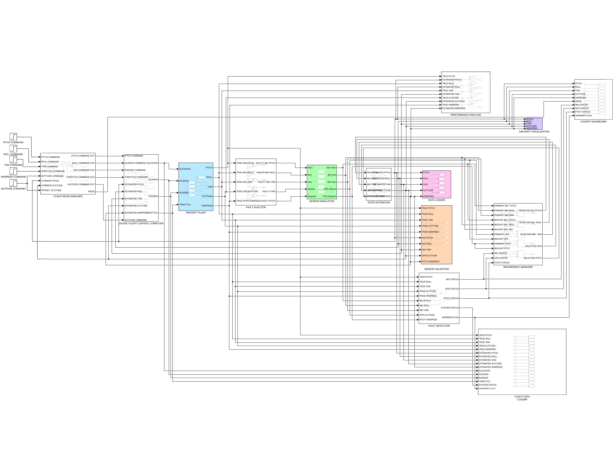

# Digital Flight Control Computer (DFCC) Simulation

> MATLAB/Simulink implementation of a Digital Flight Control Computer (DFCC) featuring Extended Kalman Filter (EKF) based state estimation, sensor fusion, flight mode management, fault detection, redundancy management, and real-time cockpit monitoring.


---

## Project Overview

This project presents a modular **Digital Flight Control Computer (DFCC)** developed in **MATLAB/Simulink** to demonstrate core concepts used in modern fly-by-wire aircraft.

The system integrates **sensor fusion**, **state estimation**, **fault detection**, **redundancy management**, and **flight control logic** into a unified simulation architecture. It is designed to provide a realistic representation of embedded aerospace control software while maintaining a modular and extensible structure.

---

## Key Features

- Extended Kalman Filter (EKF) for aircraft state estimation
- Sensor fusion using IMU, GNSS (simplified), and Pitot measurements
- Flight Mode Manager (Manual, Pitch Hold, Altitude Hold)
- Digital Flight Control Computer (DFCC)
- Fault Detection and Isolation (FDI)
- Sensor Redundancy Management
- Cockpit Dashboard for real-time monitoring
- Flight Data Logging
- Aircraft Visualization
- Performance Evaluation using RMSE
- Fault Injection for system validation

---

## System Architecture

<p align="center">
  
</p>

The simulation is organized into independent functional modules representing a modern digital flight control architecture.

---

## Project Structure

```
Digital-Flight-Control-Computer-Simulation
│
├── Simulink_Model/
│      DFCC_Simulation.slx
│
├── MATLAB/
│      run_simulation.m
│      calculate_rmse.m
│      plot_results.m
│
├── Images/
│      Architecture.png
│      CockpitDashboard.png
│      EKF.png
│      FaultDetection.png
│      FlightModes.png
│
├── Results/
│      NormalFlight.png
│      FaultInjection.png
│      RMSE.png
│
├── Documentation/
│      Project_Report.pdf
│
├── README.md
├── LICENSE
└── .gitignore
```

---

## System Components

### Aircraft Plant
Dynamic aircraft model used for flight simulation.

### Sensor Simulation
Generates measurements from:

- IMU
- GNSS (simplified position/altitude model)
- Pitot Tube

including configurable measurement noise and bias.

### State Estimation

Implements an **Extended Kalman Filter (EKF)** to estimate aircraft states using noisy sensor measurements.

### Digital Flight Control Computer

Computes actuator commands using closed-loop control based on estimated aircraft states.

### Flight Mode Manager

Supports:

- Manual Flight
- Pitch Hold
- Altitude Hold

### Fault Detection

Detects abnormal sensor behavior using threshold-based monitoring.

### Redundancy Manager

Automatically switches to backup sensor measurements during sensor failures.

### Cockpit Dashboard

Provides real-time visualization of:

- Pitch
- Roll
- Yaw
- Altitude
- Airspeed
- Flight Mode
- Sensor Health
- Warning Status

---

## Validation

The system was validated under normal operating conditions using Root Mean Square Error (RMSE).

| State | RMSE |
|-------|------:|
| Pitch | 0.00599 |
| Roll | 0.00626 |
| Yaw | 0.00480 |
| Altitude | 0.01427 |
| Airspeed | 0.01833 |

The low estimation error demonstrates accurate sensor fusion and effective EKF-based state estimation.

---

## Fault Injection

The simulation supports controlled sensor fault injection for:

- IMU Failure
- GNSS Failure
- Pitot Failure

The Fault Detection module identifies the faulty sensor, while the Redundancy Manager switches to backup measurements to maintain system operation.

---

## Technologies

- MATLAB
- Simulink
- Control Systems
- Extended Kalman Filter (EKF)
- Sensor Fusion
- Embedded Systems
- Aerospace Control
- Flight Dynamics

---

## How to Run

1. Open the project in MATLAB.
2. Open `DFCC_Simulation.slx`.
3. Run:

```matlab
run_simulation
```

4. Calculate performance:

```matlab
calculate_rmse
```

5. Visualize estimation results:

```matlab
plot_results
```

---

## Future Improvements

- Full 6-DOF aircraft dynamics
- Multi-constellation GNSS receiver model
- Adaptive Kalman Filtering
- LQR/MPC flight controller
- Hardware-in-the-Loop (HIL) integration
- AUTOSAR-compatible software architecture
- Embedded C code generation

---

## Author

**HARISH RAJI GOVINDARASSOU**

Master's Student – Embedded Systems

Electronics and Communication Engineering

---

## License

This project is released under the MIT License.
